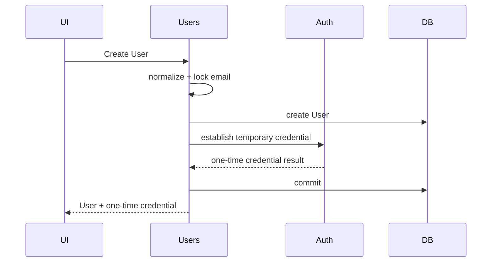
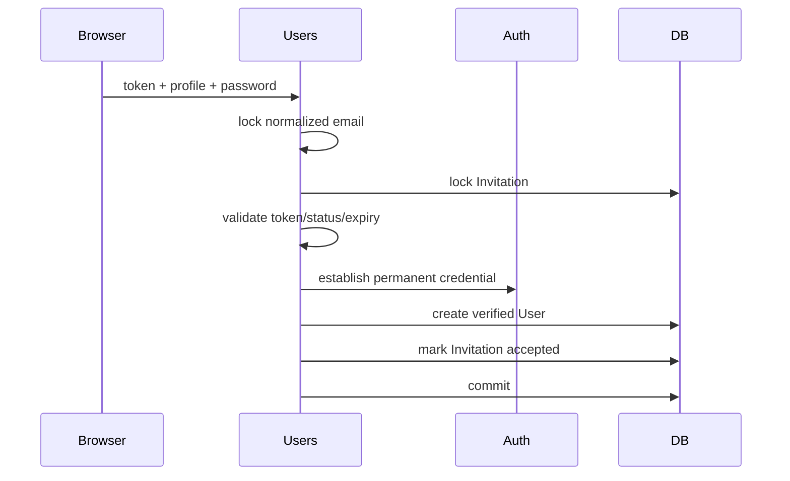

<!--
DOC-META
title: Core Users Software Design
doc_type: design
status: draft
owner: core
canonical: false
canonical_path: docs/08-design/core/users/software-design.md
parent: docs/08-design/index.md
template: docs/09-reference/templates/docs/_design.md
summary: Defines the target implementation design for Core Users, including User Accounts, invitations, lifecycle operations, public Contracts, persistence, delivery, security, concurrency, Events, and verification.
-->

# Core Users Software Design

Parent: [Software Design Index](../../index.md)

## 1. System Definition

### Purpose

Implement Core Users as the authoritative owner of permanent human User Accounts, Users-owned profile identity, account participation state, active-account suspension, primary-email state, and pre-account Invitations.

Core Users is implemented under:

```text
app/Core/Users/
App\Core\Users\
owner_key: users
```

### Scope

Core Users owns:

* permanent human User Accounts;
* first and last name;
* primary email and verification state;
* optional phone and profile-image reference;
* active/inactive lifecycle;
* active-account suspension;
* User Invitations;
* Users-owned administrative and self-service operations;
* provider-owned Users Queries and Operations;
* completed Users lifecycle Events.

### Non-Goals

Core Users does not own:

* passwords or temporary-password state;
* MFA or sessions;
* authentication assurance;
* roles, permissions, groups, or effective-access policy;
* Notification delivery;
* Audit storage;
* Preferences;
* Non-Human Identity;
* staff/HR/business attributes;
* additional contact-email records.

### State And Lifecycle

User Account state:

```text
active
active + suspended
inactive
```

Allowed transitions:

```text
active → inactive
inactive → active
active → suspended
suspended → active
suspended → inactive
```

Activation and deactivation always clear suspension state.

Supported application behavior never deletes a User Account.

Invitation state:

```text
issued → accepted
issued → revoked
issued → expired
```

Terminal Invitations are never reusable.

---

## 2. Governing Requirements

| Source                                                                                | Requirement Used                                                                                                 |
| ------------------------------------------------------------------------------------- | ---------------------------------------------------------------------------------------------------------------- |
| `docs/07-planning/02-core-capabilities/users/users-development-planning.md`           | Accepted Users ownership, lifecycle, operations, interactions, security, reliability, and verification direction |
| `docs/06-database/feature-contracts/users.md`                                         | Users persistence boundary and invariants                                                                        |
| `docs/06-database/tables/users.md`                                                    | Exact target `users` columns, constraints, indexes, and retention                                                |
| `docs/06-database/tables/user_invitations.md`                                         | Exact target Invitation columns, lifecycle, constraints, and security                                            |
| `docs/03-architecture/repository-architecture.md`                                     | Core placement and dependency topology                                                                           |
| `docs/03-architecture/public-contract-and-interaction-model.md`                       | Provider-owned Contracts and cross-owner interaction rules                                                       |
| `docs/03-architecture/application-registration.md`                                    | Owner-local registration and Provider rules                                                                      |
| `docs/02-standards/coding/repository-naming-standards.md`                             | Artifact naming                                                                                                  |
| `docs/02-standards/coding/Application Actions Services And Data Objects Standards.md` | Action, Query, Data Object, and transaction responsibilities                                                     |
| `docs/02-standards/coding/Transaction Concurrency And Idempotency Standards.md`       | Transaction, locking, concurrency, and after-commit rules                                                        |
| `docs/02-standards/security/Secrets Management Standards.md`                          | One-time secret and token handling                                                                               |
| `docs/02-standards/security/File Upload Download And Export Security Standards.md`    | Profile-image storage and access                                                                                 |

### Current Implementation Reference

Current implementation is not target authority.

Useful behavior may be retained from:

```text
app/Models/User.php
app/Http/Controllers/Platform/PlatformUserController.php
app/Http/Requests/Platform/*
resources/views/platform/users/*
routes/web.php
```

Target design rejects the current coupling of the User Model to Auth, MFA, roles, Notifications, staff/business fields, and additional contact emails.

---

## 3. Component Design

### Core Persistence And Values

| Component          | Archetype             | Responsibility                                             | Target Path                                    |
| ------------------ | --------------------- | ---------------------------------------------------------- | ---------------------------------------------- |
| `User`             | Model                 | Current authoritative User Account state                   | `app/Core/Users/Models/User.php`               |
| `UserInvitation`   | Model                 | Current Invitation state                                   | `app/Core/Users/Models/UserInvitation.php`     |
| `InvitationStatus` | Enum                  | `issued`, `accepted`, `revoked`, `expired`                 | `app/Core/Users/Enums/InvitationStatus.php`    |
| `UserEmail`        | Value Object          | Preserve validated email and deterministic normalized form | `app/Core/Users/Values/UserEmail.php`          |
| `UserEmailLock`    | Concurrency component | Serialize email-keyed User/Invitation mutations            | `app/Core/Users/Concurrency/UserEmailLock.php` |

`User` is an Eloquent Model owned by Users. It must not expose Auth, Access, Notifications, or other owner behavior through model traits or relationships.

### Actions

```text
CreateUserAction
UpdateUserAction
ActivateUserAction
DeactivateUserAction
SuspendUserAction
UnsuspendUserAction

UpdatePrimaryEmailAction
VerifyPrimaryEmailAction
ResendEmailVerificationAction

CreateInvitationAction
ReissueInvitationAction
RevokeInvitationAction
AcceptInvitationAction
```

Location:

```text
app/Core/Users/Actions/
```

Each Action owns its mutation and transaction boundary.

### Queries

```text
GetUserQuery
ListUsersQuery
SearchUsersQuery

GetInvitationQuery
ListInvitationsQuery
SearchInvitationsQuery

FindUserByLoginIdentifierQuery
GetUserAccountStateQuery
SearchUserDirectoryQuery
GetUserContactQuery
GetUserPresentationIdentityQuery
```

Location:

```text
app/Core/Users/Queries/
```

No Query exposes an Eloquent Model across an ownership boundary.

### Data Objects

Required internal/public shapes include:

```text
CreateUserData
UpdateUserData
UpdatePrimaryEmailData
SuspendUserData

CreateInvitationData
AcceptInvitationData

UserSearchCriteria
InvitationSearchCriteria

UserSnapshot
UserAuthenticationSnapshot
UserAccountStateSnapshot
UserDirectoryEntry
UserContactSnapshot
UserPresentationIdentity
InvitationSnapshot

CreateUserResult
AcceptInvitationResult
```

Location:

```text
app/Core/Users/Data/
```

---

## 4. Contracts And Interactions

### Public Users Contracts

Confirmed cross-owner Users promises:

| Contract                               | Consumer      | Implementation                     |
| -------------------------------------- | ------------- | ---------------------------------- |
| `FindUserByLoginIdentifierInterface`   | Auth          | `FindUserByLoginIdentifierQuery`   |
| `GetUserAccountStateInterface`         | Auth          | `GetUserAccountStateQuery`         |
| `SearchUserDirectoryInterface`         | Access        | `SearchUserDirectoryQuery`         |
| `GetUserContactInterface`              | Notifications | `GetUserContactQuery`              |
| `GetUserPresentationIdentityInterface` | Workspace     | `GetUserPresentationIdentityQuery` |
| `SuspendUserInterface`                 | Security      | `SuspendUserAction`                |
| `UnsuspendUserInterface`               | Security      | `UnsuspendUserAction`              |

Location:

```text
app/Core/Users/Contracts/
```

Contracts return Users-owned immutable Data Objects, never Models or query builders.

### Auth Dependencies

Users requires Auth-owned Operations for:

```text
establish administrator temporary password
establish user-selected password
revoke sessions when lifecycle/security behavior requires it
recent-authentication / step-up verification
```

Exact Auth Contract names remain blocked on the accepted Auth design.

### Access Dependencies

Users requires Access for:

```text
operation authorization
effective-administrator evaluation
assignment/review User directory consumption
```

Users owns lifecycle invariants. Access owns authorization meaning.

### Key Interaction — Direct User Creation



User persistence and required initial Auth credential must succeed or fail as one effective operation.

The exact cross-owner transaction participation mechanism remains dependent on Auth design.

### Key Interaction — Invitation Acceptance



Repeated or concurrent acceptance must create at most one User Account.

---

## 5. Data And Persistence

### Models

`App\Core\Users\Models\User` maps only Users-owned state.

It must not retain current-model concerns including:

```text
password
remember_token
last_login_at
MFA relations
role/permission traits
notification preferences
timezone preference
theme preference
hourly rate
staff/administrator flags
additional contact emails
```

`App\Core\Users\Models\UserInvitation` maps `user_invitations`.

### Email Normalization

`UserEmail` owns one normalization rule used by all Users mutations and lookup Queries:

```text
trim input
validate accepted email form
preserve trimmed application value
lowercase normalized lookup value
```

Only `normalized_email` participates in uniqueness and login lookup.

### Database Constraints

Implementation must enforce the canonical table Contracts in PostgreSQL.

`users` requires:

* PK `id`;
* unique `normalized_email`;
* active/deactivation consistency checks;
* suspension-state consistency checks;
* active/inactive filtering index.

`user_invitations` requires:

* PK `id`;
* unique `token_hash`;
* partial unique index on `normalized_email` where `status = 'issued'`;
* unique nullable `accepted_user_id`;
* FK to `users.id` without cascading User deletion;
* lifecycle consistency checks;
* `expires_at > issued_at`.

### Token Handling

Invitation plaintext is generated from cryptographically secure random bytes.

Only a one-way hash is persisted.

Plaintext must never enter:

```text
database persistence
logs
Audit metadata
Monitoring
exceptions
Notifications persistence
debug output
```

### Concurrency

All operations competing for the same normalized email must acquire the same transaction-scoped PostgreSQL advisory lock through `UserEmailLock`.

Applicable operations:

```text
Create User
Update Primary Email
Create Invitation
Reissue Invitation
Accept Invitation
```

When two email keys are involved, acquire locks in deterministic normalized lexical order.

Lifecycle Actions also lock the target User row before transition.

Invitation transitions lock the Invitation row before state validation and mutation.

Database uniqueness remains the final integrity backstop.

### Migration Placement

New schema-lifecycle source belongs under:

```text
database/core/Users/migrations/
database/core/Users/factories/
database/core/Users/seeders/
```

Historical migrations remain historical source. Target alignment is performed through new migrations rather than rewriting previously applied migrations.

---

## 6. Delivery And Presentation

### Owner-Local Delivery

Target Delivery Adapters live under:

```text
app/Core/Users/Http/Controllers/
app/Core/Users/Http/Requests/
app/Core/Users/routes/
```

Initial controller responsibilities:

```text
UserController
UserLifecycleController
UserPrimaryEmailController
UserInvitationController
InvitationAcceptanceController
UserProfileController
```

Controllers:

* receive validated Requests;
* invoke Users Actions/Queries;
* perform no direct persistence;
* do not directly manipulate Auth, Access, Audit, or Notifications internals.

### Target Presentation

Views move to:

```text
resources/views/core/users/
```

Required presentation families:

```text
administrative User list
administrative create/edit
User lifecycle actions
Invitation administration
Invitation acceptance
self-service profile
primary-email verification state
one-time temporary-password display
```

Reusable UI uses existing UI Components/Patterns rather than Users-owned duplication.

### Profile Images

Profile images are treated as private application files, not arbitrary public-disk uploads.

Users stores only the approved storage reference in `profile_image_path`.

Upload handling must:

* validate MIME/type/size;
* use server-generated filenames;
* use scoped private storage;
* authorize access;
* avoid predictable public paths.

### Registration

Create:

```text
app/Core/Users/Providers/UsersServiceProvider.php
```

The Provider owns Users-local:

* public Contract bindings;
* route registration;
* migration registration;
* view registration;
* Event registration where applicable.

It acts as the Users owner-controlled registration mechanism accepted by Application Registration architecture.

---

## 7. Security And Reliability

### Authorization

All protected Users operations require Access authorization.

Users additionally enforces invariant rejection for:

* self-deactivation;
* self-suspension;
* duplicate primary email;
* duplicate outstanding Invitation;
* Invitation targeting an existing User;
* invalid lifecycle transitions.

Human administrator operations requiring recent authentication:

```text
Activate User
Deactivate User
Suspend User
Unsuspend User
Update another User's primary email
administrator temporary-password reset
administrator MFA reset
administrator session revocation
```

Exact Access permission Contracts and Auth step-up Contracts remain upstream dependencies.

### Last Administrator

Human administrative deactivation/suspension must not leave the Instance without a usable effective administrator.

Security-initiated automated suspension may fail secure and suspend the final administrator.

The exact concurrency-safe interaction with Access remains blocked on Access design; a simple read-then-mutate check is insufficient.

### Invitation Security

Acceptance requires:

```text
status = issued
valid secret
current time < expires_at
email still available
```

Unauthenticated failure responses must not unnecessarily disclose whether an account already exists.

### Reliability

Mutation Actions own their transaction boundaries.

After-commit behavior is required for Events and side effects that represent committed state.

No notification, public Event, or success Audit evidence may claim success before the underlying Users transaction commits.

---

## 8. Events And Operational Effects

### Public Events

Users publishes:

```text
UserCreated
UserActivated
UserDeactivated
UserSuspended
UserUnsuspended
UserPrimaryEmailUpdated
UserPrimaryEmailVerified

InvitationIssued
InvitationReissued
InvitationRevoked
InvitationAccepted
```

Location:

```text
app/Core/Users/Events/
```

Events:

* represent completed facts;
* contain explicit boundary data;
* never expose Users Models;
* publish after durable state change;
* do not replace synchronous Auth/Access interactions.

No initial Event is required for:

```text
ordinary profile-field edits
Invitation expiration caused only by passage of time
```

### Audit

Audit must preserve the material lifecycle facts listed by the Users data Contracts.

Exact Audit Contract/listener integration and failure semantics remain dependent on accepted Audit design.

### Monitoring

Unexpected persistence, transaction, token, Auth dependency, or Event-delivery failures are operational failures exposed to Monitoring.

Expected business rejection is not converted into an operational failure merely because the request is denied.

### Notifications

Notifications owns delivery.

Users requires notification behavior for:

* Invitation delivery;
* required primary-email verification;
* other accepted lifecycle attention where later Notifications design requires it.

Invitation plaintext must cross into Notifications only through an accepted transient secret-safe Contract and must not become durable Notification payload data.

Exact Notification Contract design remains an upstream dependency.

---

## 9. Implementation Manifest

### Target Core Users Source

| Change | Path                                                | Responsibility                          |
| ------ | --------------------------------------------------- | --------------------------------------- |
| CREATE | `app/Core/Users/Models/User.php`                    | User persistence model                  |
| CREATE | `app/Core/Users/Models/UserInvitation.php`          | Invitation persistence model            |
| CREATE | `app/Core/Users/Enums/InvitationStatus.php`         | Invitation lifecycle values             |
| CREATE | `app/Core/Users/Values/UserEmail.php`               | Email normalization/value invariant     |
| CREATE | `app/Core/Users/Concurrency/UserEmailLock.php`      | Email-keyed PostgreSQL concurrency lock |
| CREATE | `app/Core/Users/Actions/*.php`                      | Users mutation operations defined in §3 |
| CREATE | `app/Core/Users/Queries/*.php`                      | Users reads defined in §3               |
| CREATE | `app/Core/Users/Data/*.php`                         | Typed input/result/snapshot Contracts   |
| CREATE | `app/Core/Users/Contracts/*.php`                    | Provider-owned cross-owner Contracts    |
| CREATE | `app/Core/Users/Events/*.php`                       | Public completed-fact Events            |
| CREATE | `app/Core/Users/Http/Controllers/*.php`             | Users Delivery Adapters                 |
| CREATE | `app/Core/Users/Http/Requests/*.php`                | Request validation                      |
| CREATE | `app/Core/Users/Providers/UsersServiceProvider.php` | Users registration                      |
| CREATE | `app/Core/Users/routes/web.php`                     | Owner-local web routes                  |
| CREATE | `app/Core/Users/__tests__/`                         | Owner-local verification source         |
| CREATE | `database/core/Users/migrations/`                   | Target Users schema evolution           |
| CREATE | `database/core/Users/factories/`                    | User/Invitation factories               |
| CREATE | `resources/views/core/users/`                       | Users-owned presentation                |

### Transitional Source To Retire Or Reconcile

These are current-state evidence, not target destinations:

```text
app/Models/User.php
app/Http/Controllers/Platform/PlatformUserController.php
app/Http/Controllers/Platform/PlatformUserMfaController.php
app/Http/Requests/Platform/*
resources/views/platform/users/*
routes/web.php Users-specific route definitions
Modules/Account/Models/UserContactEmail.php
```

Their physical removal must occur only when dependent Auth, Access, Account, Notifications, route, and compatibility work has been migrated.

Do not create a compatibility alias automatically merely to preserve the current architecture.

---

## 10. Verification And Completion

### Required Proof

Future implementation issues must cover at minimum:

* User permanence and absence of delete behavior;
* normalized-email uniqueness;
* User state transition invariants;
* suspension behavior;
* inactive/suspended authentication rejection through Auth;
* self-target administrative denial;
* last-administrator protection;
* direct administrator creation;
* temporary-password consistency;
* primary-email update and verification reset;
* Invitation issue/reissue/revoke/expiry/acceptance;
* plaintext token non-persistence;
* concurrent Invitation acceptance;
* direct-create versus Invitation race behavior;
* PostgreSQL constraints and locking behavior;
* public Contract boundaries;
* no cross-owner Model/table access;
* Events only after successful state change;
* secret and PII redaction;
* private profile-image handling.

PostgreSQL-backed proof is mandatory for constraints, locking, and concurrency behavior.

### Manual / Specialist Review

Required where applicable:

* Security review of Invitation/token and one-time-secret handling;
* database review of constraints, locks, and migrations;
* UI/accessibility review of administrative, onboarding, verification, and one-time-secret surfaces.

### Remaining Blockers

1. **Auth design:** exact Auth-owned Operations, result shapes, step-up Contract, session-revocation Contract, and transaction-participation semantics.
2. **Access design:** exact authorization Contracts and concurrency-safe last-effective-administrator evaluation.
3. **Notifications design:** exact transient Invitation delivery and persistent email-verification Notification Contracts.
4. **Audit design:** exact Audit interaction, Actor boundary data, and Audit failure semantics.
5. **Invitation retention:** terminal Invitation retention duration remains unresolved in the canonical database Contract.

### Implementation Ready

* [x] Core Users ownership and scope are defined.
* [x] User and Invitation lifecycle is defined.
* [x] Target persistence and primary constraints are defined.
* [x] Users-owned component topology is defined.
* [x] Users-owned public Contract responsibilities are identified.
* [x] Core concurrency strategy is defined for Users-owned email/Invitation races.
* [x] Target implementation placement is defined.
* [x] Verification surfaces are identified.
* [ ] Required Auth Contracts are accepted.
* [ ] Required Access Contracts are accepted.
* [ ] Required Notifications integration is accepted.
* [ ] Required Audit integration is accepted.
* [ ] Invitation terminal retention is accepted.
* [ ] No material design blocker remains.

**Current design state: draft; not yet implementation-ready.**
