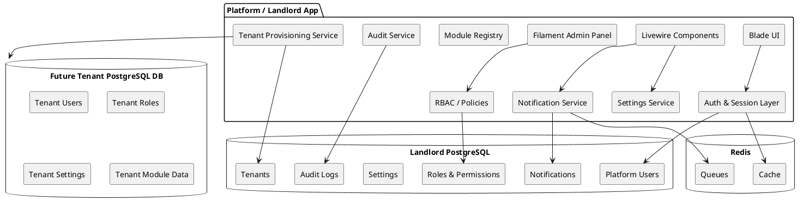

# Phase 1 - Platform Foundation Planning

## Purpose

Provide a dedicated working note for Phase 1 planning, review notes, and implementation sequencing.

Use this note as the active planning surface for the first V2 build phase.

This note is the root planning note for the Phase 1 branch.

## Implementation Status

Current status:

* Phase 1 is active and partially implemented
* Batch 1 foundation work is implemented and live on staging
* Batch 2 platform shell and docs-vault work is implemented and live on staging
* Batch 3 notifications UI, audit log viewer, and role/permission seeding cleanup are implemented in code and pending staging deploy
* Batch 4 Reverb and Echo realtime notifications are implemented in code and pending staging deploy plus runtime setup
* canonical system docs now exist for implemented auth, logging, RBAC, notifications/settings, and platform workspace surfaces

Canonical docs:

* [[V2 App/Features/Authentication]] | [Authentication](../../Features/Authentication.md)
* [[V2 App/Features/Event And Error Logging]] | [Event And Error Logging](../../Features/Event%20And%20Error%20Logging.md)
* [[V2 App/Features/Platform Users And RBAC]] | [Platform Users And RBAC](../../Features/Platform%20Users%20And%20RBAC.md)
* [[V2 App/Features/Platform Notifications And Settings]] | [Platform Notifications And Settings](../../Features/Platform%20Notifications%20And%20Settings.md)
* [[V2 App/Features/Platform Workspace And Documentation Vault]] | [Platform Workspace And Documentation Vault](../../Features/Platform%20Workspace%20And%20Documentation%20Vault.md)
* [[V2 App/Development/Phase 1 Development Log]] | [Phase 1 Development Log](../../Development/Phase%201%20Development%20Log.md)

## Phase Scope

Phase 1 is the shared core-app foundation phase.

Its goal is to establish the shared business-application foundation that the Parasolutions internal platform instance will use first and future tenant instances should also inherit.

## In Scope

Current Phase 1 planning areas:

* platform staff authentication
* shared user and role foundation
* shared dashboard shell
* shared business-feature baseline
* central platform audit logging
* central error and security logging
* shared notifications and options/configuration conventions

## Planning Stance

Phase 1 should optimize for strong shared foundations, not raw feature count.

The goal is to establish the control-plane rules that every later tenant feature and module must follow for:

* authentication
* authorization
* logging and auditability
* notifications
* configuration/options
* naming and release conventions

It should also establish the reusable core-app patterns that later platform-management and tenantization work will build on.

## Out Of Scope

These are not the primary target of Phase 1:

* deep tenantization/provisioning implementation
* full tenant content management
* website builder/editor implementation
* advanced tenant modules
* broad V1 CRM feature parity

## Planning Questions

Use this section to capture decisions still being worked through.

Current questions:

1. How should platform staff auth and future tenant auth be separated at the guard and panel level?
2. Which shared business features must be treated as core-app foundations in Phase 1?
3. Which auth, role, logging, and configuration rules must be mandatory for every future module?
4. Which operational events must always remain centrally visible?
5. What boundaries must be preserved now so tenantization later does not require large rewrites?

## Candidate Deliverables

Phase 1 should likely produce:

* core auth foundation
* initial shared dashboard shell
* reusable user/role/permission baseline
* platform logging baseline
* shared notification and options conventions
* a stable boundary between core-app capabilities and future platform-management features

## Reviewed Notes Summary

The notes added during review point in a strong direction and are mostly aligned with the current V2 architecture.

The main recommendation from those notes is:

* Phase 1 should establish the shared core app first
* the internal platform instance should be the first real consumer of that shared core
* platform-management features should be layered on top rather than treated as the whole app
* tenantization should be designed early enough to avoid bad assumptions, but not implemented as the whole identity of Phase 1

## Corrections To Keep This Note Aligned With Current V2 Decisions

The current direction should now be read with this clarified product model:

* the internal platform instance is not only a control plane
* it should also use the shared core business app that future tenant instances will use
* platform-management and tenantization are additional layers, not the only identity of the product

Current V2 direction is already stronger than that:

* one central platform database
* one separate PostgreSQL database per tenant
* one PostgreSQL role per tenant

That should remain the later tenantization baseline.

## Working Specification Notes

## Background

You are planning a multi-tenant Laravel platform with a privileged base admin instance and future tenant instances, using PHP 8.3, Laravel 13.x, Blade, Filament, Livewire, PostgreSQL 16, Redis 7, Docker Compose, Vite, Tailwind CSS, and Apache + PHP-FPM. The immediate goal of Phase 1 is to establish consistent platform-wide foundations before advanced tenant features are introduced.

The main intent of this phase is not to maximize feature count, but to standardize cross-cutting concerns early so that every later module follows the same rules for authentication, authorization, logging, notifications, options/configuration, session handling, naming, and release/versioning.

Assumptions for this draft:

* The base internal platform instance is the first consumer of the shared core app.
* Platform-management features are layered on top of that internal instance.
* Tenant applications will use isolated tenant databases rather than sharing the platform database.
* Filament will be used for privileged internal/admin workflows, while Blade/Livewire may continue to power non-panel application UI.
* Phase 1 should produce conventions and technical primitives that future contractors can implement consistently without inventing module-specific patterns.

## Requirements

### Must have

* Establish a canonical naming model for platform features, modules, permissions, options groups, logs, notifications, routes, and internal package/service naming.
* Establish baseline authentication flows for login, logout, registration/invitation, password reset, password change, password hashing, session-backed authentication, and CSRF-protected web interactions.
* Establish a baseline authorization model for:

  * platform-level super admins
  * admin/operator roles
  * tenant-scoped roles
  * permission overrides where required
* Define whether roles are rigid or act as defaults that can be customized by higher-privileged users.
* Define how the base admin instance can act as a control-plane super admin across tenant instances.
* Require all features/modules to declare their permissions during feature design.
* Require all features/modules to emit structured logs and auditable activity events.
* Define the session strategy for web authentication, expiry, revocation, “remember me”, concurrent session handling, and tenant context handling.
* Define a standardized in-app notification model with severity levels, icons, audience targeting, read/unread state, and optional delivery channels.
* Define a standardized options/configuration model so every feature introduces its own options category consistently.
* Define an application and module versioning/release policy with clear rules for major, minor, and patch changes.

### Should have

* Prefer role-based access control with permission-level overrides rather than hard-coded account types.
* Support tenant-aware permissions from the start, even if Phase 1 uses a simplified tenancy model.
* Define a common audit vocabulary for security-sensitive actions such as login, logout, password changes, permission changes, impersonation, and configuration changes.
* Define notification taxonomy such as alert, error, urgent, notice, success, and informational.
* Define default metadata standards for logs and notifications, including actor, tenant, module, action, correlation ID, and severity.
* Define a feature bootstrap checklist so new modules must include permissions, logs, notifications, and options before being considered complete.
* Separate platform configuration from tenant configuration.

### Could have

* Add impersonation support for platform admins with strong audit trails.
* Add email verification and optional MFA/TOTP readiness into the Phase 1 architecture, even if rollout is deferred.
* Add module manifests so each module can self-register permissions, settings groups, navigation labels, icons, and version metadata.
* Add event-driven notification fan-out using queues for non-blocking delivery.

### Won’t have in Phase 1

* Full tenant billing, subscription, or metering logic.
* Deep per-module release independence unless modules are physically packaged and deployed independently.
* Complex cross-tenant data sharing rules beyond platform-admin control-plane access.

## Method

### 1. Architectural stance for Phase 1

Phase 1 should be implemented as a **shared core business application foundation** used first by the internal platform instance, with the **platform-management layer** and **tenantization layer** designed clearly enough that they can be added without rewriting the shared core.

This creates a clear separation:

* **Shared core app** contains reusable business features and rules.
* **Platform-management layer** contains Parasolutions-only control-plane capabilities.
* **Tenantization layer** contains the infrastructure and runtime model for isolated tenant instances.

The platform database still stores platform-level concerns such as:

* platform users
* global roles
* platform permissions
* tenant registry and tenant connection metadata
* audit logs for control-plane actions
* global notifications metadata
* module catalog/version metadata
* **Tenant databases** are future isolated runtime databases for tenant-scoped application data.
* A **tenant database template** is defined in code through migrations, seeders, and provisioning conventions so staging and production tenant creation are deterministic.

Laravel supports multiple database connections natively, which is sufficient for the underlying connection model. For tenancy orchestration later, `stancl/tenancy` is still the strongest current fit because its v3 documentation explicitly supports multi-database tenancy, tenant database managers, tenant identification, and configurable tenant database creation flows.

### 2. Tenancy foundation

For your specific use case, `stancl/tenancy` v3 is the most natural default recommendation.

Reasons:

* it explicitly supports **multi-database tenancy**
* it supports tenant database managers, including PostgreSQL database creation flows
* it supports domain-based tenant identification
* it is more feature-complete for full tenancy orchestration than simpler context-switching packages
* it fits a landlord control plane with future tenant app instances well

The package's current v3 documentation explicitly covers multi-database tenancy, tenant models, tenant database managers, database customization, and even synced resources between central and tenant databases where needed. That makes it a strong standard choice for your stack rather than a risky custom tenancy foundation. ([tenancyforlaravel.com](https://tenancyforlaravel.com/docs/v3/multi-database-tenancy/?utm_source=chatgpt.com))

Recommended Phase 1 position:

* keep `stancl/tenancy` v3 as the leading implementation candidate
* design the shared core app so it is tenantizable later
* define tenant database provisioning through package-supported database management hooks when the tenantization phase starts
* do not yet overbuild central/tenant resource syncing unless a concrete requirement appears

This should be treated as the current leading recommendation, not as an irreversible commitment before implementation review.

### 3. Authorization model

Phase 1 should adopt **RBAC only** as the baseline authorization model.

This means:

* permissions are defined centrally
* roles are composed from permissions
* users receive roles, not ad hoc direct permissions
* features declare the required permission or role policy during design
* super admins bypass authorization through a global policy rule

This is preferable to RBAC plus direct permission overrides in Phase 1 because:

* it reduces operational complexity
* it keeps feature design simpler and more predictable
* it avoids hidden authorization drift caused by one-off user exceptions
* it makes audits and support easier
* it aligns well with your stated desire for a single “role required” style requirement during feature planning

Spatie’s current package supports role/permission assignment cleanly and recommends implementing super-admin access via `Gate::before`, which fits the landlord control-plane model well. ([spatie.be](https://spatie.be/docs/laravel-permission/v7/basic-usage/super-admin?utm_source=chatgpt.com))

Recommended rule set:

* **Platform Super Admin**: unrestricted across landlord and tenant management flows.
* **Platform Admin**: manages tenants, platform settings, platform users, module configuration, and operational visibility.
* **Platform Operator**: limited operational actions such as support, audit review, notifications review, and controlled tenant support workflows.
* **Tenant roles**: defined in the tenant template for future tenant instances and managed separately from landlord roles.

Important constraint:

* landlord roles must not be reused as tenant runtime roles.
* platform authorization and tenant authorization should be modeled as distinct scopes, even if naming conventions are similar.

### 4. Naming and module conventions

To avoid ambiguity, the platform should standardize the following vocabulary:

* **Platform**: the landlord/base admin product.
* **Tenant**: a customer instance with its own isolated database.
* **Module**: a bounded functional area, such as Users, Notifications, Audit, Billing, CRM, etc.
* **Feature**: a user-visible capability within a module.
* **Action**: a permissionable operation such as `view`, `create`, `update`, `delete`, `export`, `approve`, `configure`.
* **Setting**: a configurable option belonging to the platform or a module.
* **Policy key**: canonical permission string in the form `scope.module.action`.

Recommended permission naming convention:

* `platform.users.view`
* `platform.users.create`
* `platform.roles.manage`
* `platform.tenants.provision`
* `platform.notifications.manage`
* `tenant.invoices.view`
* `tenant.invoices.create`

Recommended route naming convention:

* `platform.users.index`
* `platform.users.edit`
* `platform.tenants.show`
* `tenant.dashboard`

Recommended config/setting key convention:

* `platform.auth.password_expiry_days`
* `platform.notifications.default_channels`
* `module.crm.default_pipeline_id`

Every new module must ship with:

* module key
* display label
* icon key
* permission list
* settings group
* notification event types
* audit event types
* version metadata

### 5. Authentication, global identities, and tenant access handoff

Phase 1 should use Laravel’s standard web authentication model for the landlord control plane, but should **not** rely on sharing one browser session/cookie directly across landlord and tenant GUIs unless the entire deployment is deliberately engineered as a tightly controlled same-parent-domain setup and you are willing to accept the larger blast radius that comes with shared trust boundaries.

For your requirement that a Platform Super Admin can click a button in the platform GUI and enter a tenant GUI without a second login, the recommended pattern is:

* landlord user authenticates normally to the platform
* landlord app verifies the user has platform authority to access the target tenant
* landlord app generates a **short-lived, single-use handoff token** or signed entry URL for that specific tenant and target route
* tenant app validates the token/signature, establishes a tenant-side admin session for that actor, records a full audit event, and redirects to the requested dashboard/index page
* tenant UI displays a persistent banner such as `Acting as Platform Super Admin via Control Plane`

Laravel natively supports signed and temporary signed URLs, which are useful building blocks for a secure handoff flow, though for a true one-time login handoff you should back the transfer with a server-side token record rather than rely on URL signature alone. ([laravel.com](https://laravel.com/docs/13.x/urls?utm_source=chatgpt.com))

Recommended handoff token fields in the landlord database:

* `id` UUID
* `platform_user_id`
* `tenant_id`
* `intended_route`
* `reason` nullable but recommended
* `issued_at`
* `expires_at`
* `used_at` nullable
* `used_from_ip` nullable
* `user_agent` nullable
* `revoked_at` nullable
* `metadata` JSONB

Validation rules:

* expiry 30–120 seconds
* one-time use only
* token bound to the target tenant
* token bound to a specific post-login route or dashboard
* optional re-confirmation for high-risk actions
* full audit logging on issue and consume

This gives you near-SSO convenience while preserving tenant-level traceability and revocability.

Global identity stance:

* **platform identities may be mirrored into tenant contexts only for privileged support/admin access**
* normal tenant users should remain tenant-local identities
* mirrored/global privileged identities should be provisioned through a controlled mapping model, not by fully sharing the same user table across all tenant databases on day one

Recommended model for Phase 1:

* landlord `platform_users` remain the source of truth for platform admins
* each tenant database may contain a mapped shadow/admin identity record when access is granted or first used
* the handoff process creates or resolves the tenant-side identity deterministically
* tenant authorization still uses tenant-scoped roles, even for mirrored platform identities

`stancl/tenancy` documents synced resources between central and tenant databases, including users, but notes this is a relatively complex feature and should only be implemented when truly needed. For Phase 1, a controlled admin mapping/handoff model is lower risk than broad user syncing. ([tenancyforlaravel.com](https://tenancyforlaravel.com/docs/v3/synced-resources-between-tenants/?utm_source=chatgpt.com))

Phase 1 should therefore formalize:

* session-backed authentication for browser users
* CSRF protection for all state-changing web requests
* password hashing using Laravel defaults
* password reset flow
* password change flow
* optional email verification readiness
* future MFA readiness without implementing it immediately
* tenant admin access via signed, expiring, single-use handoff

Laravel’s `web` middleware group already provides session state, cookie encryption, CSRF protection, and related request protections. Phase 1 should formalize these defaults rather than replacing them with custom auth logic. ([laravel.com](https://laravel.com/docs/13.x/authentication?utm_source=chatgpt.com))

Session policy should be explicitly documented as follows:

* landlord users authenticate only against the landlord app/session domain
* tenant context is never inferred only from user role; it must be explicit in route/domain/context resolution
* idle timeout and absolute timeout must be defined centrally
* “remember me” behavior must be documented and disabled by default for privileged platform users unless specifically approved
* password changes revoke other active sessions
* admin handoff sessions into tenants must be visibly marked and time-limited
* super-admin impersonation, if later added, must create auditable session markers

## Recommended Phase 1 Planning Structure

At this point it is better to use a hybrid approach:

* keep active, not-yet-settled decision work inside a dedicated `Planning/Phase 1/` branch
* begin splitting the major Phase 1 concerns into focused planning notes now
* only promote a note into permanent architecture, feature, reference, or runbook ownership when the decision is settled enough to be canonical

That avoids polluting permanent docs too early while still preventing this note from becoming an oversized catch-all.

## Next Phase 1 Planning Notes

The current notes support breaking Phase 1 into these child planning notes:

* auth and authorization foundation
* tenancy and provisioning foundation
* logging, notifications, and options foundation

## Related

* [[V2 App/Planning/Phase 1/Phase 1 Index]] | [Phase 1 Index](Phase%201%20Index.md)
* [[V2 App/Planning/V2 Feature Roadmap]] | [V2 Feature Roadmap](../V2%20Feature%20Roadmap.md)
* [[V2 App/Architecture/Core App And Platform Layer Model]] | [Core App And Platform Layer Model](../../Architecture/Core%20App%20And%20Platform%20Layer%20Model.md)
* [[V2 App/Architecture/Platform And Tenant Application Boundary]] | [Platform And Tenant Application Boundary](../../Architecture/Platform%20And%20Tenant%20Application%20Boundary.md)
* [[V2 App/Architecture/V2 Application Structure]] | [V2 Application Structure](../../Architecture/V2%20Application%20Structure.md)

Recommended session storage approach:

* use Redis for application cache and queues
* use database-backed sessions first for easier auditability and inspection during Phase 1, unless performance requirements already justify Redis sessions

Laravel supports configurable session drivers, and Redis is also first-class for cache/queue infrastructure. ([laravel.com](https://laravel.com/docs/13.x/redis?utm_source=chatgpt.com))

### 6. Logging and audit design

Phase 1 should use Laravel’s standard web authentication model:

* session-backed authentication for browser users
* CSRF protection for all state-changing web requests
* password hashing using Laravel defaults
* password reset flow
* password change flow
* optional email verification readiness
* future MFA readiness without implementing it immediately

Laravel’s `web` middleware group already provides session state, cookie encryption, CSRF protection, and related request protections. Phase 1 should formalize these defaults rather than replacing them with custom auth logic. citeturn430694search0

Session policy should be explicitly documented as follows:

* landlord users authenticate only against the landlord app/session domain
* tenant context is never inferred only from user role; it must be explicit in route/domain/context resolution
* idle timeout and absolute timeout must be defined centrally
* “remember me” behavior must be documented and disabled by default for privileged platform users unless specifically approved
* password changes revoke other active sessions
* super-admin impersonation, if later added, must create auditable session markers

Recommended session storage approach:

* use Redis for application cache and queues
* use database-backed sessions first for easier auditability and inspection during Phase 1, unless performance requirements already justify Redis sessions

Laravel supports configurable session drivers, and Redis is also first-class for cache/queue infrastructure. ([laravel.com](https://laravel.com/docs/13.x/redis?utm_source=chatgpt.com))

### 5. Logging and audit design

You should distinguish between:

* **application logs** for runtime/system diagnostics
* **audit logs** for user and administrative actions

Phase 1 should require all modules to emit auditable events for sensitive actions. Minimum audit fields:

* event UUID
* occurred_at timestamp
* actor_type
* actor_id
* tenant_id nullable
* module_key
* action_key
* target_type nullable
* target_id nullable
* severity
* summary
* metadata JSONB
* request_id / correlation_id
* ip_address
* user_agent

Minimum auditable events in Phase 1:

* login succeeded/failed
* logout
* password changed
* password reset requested/completed
* role created/updated/deleted
* role assigned/removed
* tenant created/updated/suspended
* settings changed
* module enabled/disabled
* notification sent
* impersonation started/ended if implemented later

PostgreSQL 16 is a good fit here because JSONB fields make structured audit metadata practical without over-normalizing early.

### 6. Notification design

Notifications should be standardized as a platform service, not a per-module afterthought.

Recommended severity taxonomy:

* `success`
* `info`
* `notice`
* `warning`
* `error`
* `urgent`

Recommended notification attributes:

* notification UUID
* audience scope: platform user, tenant user, role, or system
* module key
* icon key
* severity
* title
* body
* action URL nullable
* created_at
* read_at nullable
* dismissed_at nullable
* delivery channels JSONB
* metadata JSONB

Recommended behavior:

* all user-facing modules may publish to a global notification inbox
* notifications should include a module icon and module label for fast recognition
* urgent/error notifications may optionally trigger email later
* delivery should be queueable so feature flows are not blocked by notification fan-out

### 7. Options/settings design

Every module must define its settings during initial design.

Settings should be modeled in two scopes:

* **platform settings** in the landlord database
* **tenant settings** in future tenant databases

Recommended table shape for flexible settings storage:

* `settings`

  * `id`
  * `scope_type` (`platform`, `tenant`, `module`)
  * `scope_id` nullable
  * `module_key`
  * `group_key`
  * `key`
  * `value_jsonb`
  * `data_type`
  * `is_encrypted`
  * `is_public`
  * `updated_by`
  * timestamps

Rules:

* settings keys are immutable after release unless a migration handles the rename
* secrets must be encrypted
* each module must document defaults
* settings changes must generate audit events

### 8. Versioning and classification

Use **semantic versioning** for the platform:

* **major**: breaking changes in schema, APIs, contracts, module manifests, or operational behavior
* **minor**: backward-compatible features and module additions
* **patch**: backward-compatible fixes and security updates

Recommended interpretation:

* `1.0.0`: first stable production baseline of the whole platform
* `1.1.0`: new backward-compatible platform capability
* `1.1.3`: fixes only
* `2.0.0`: breaking authorization, tenancy, schema, or module contract changes

Modules should only receive independent versions if they are actually packaged, migrated, and deployed with independence. Otherwise, track module compatibility inside the base platform release.

Recommended model:

* one platform release version
* optional per-module internal schema/version metadata for diagnostics
* tenant template schema version tracked explicitly so provisioning and upgrades can be deterministic

### 9. Initial database model

Recommended Phase 1 central tables:

* `users`
* `password_reset_tokens`
* `roles`
* `permissions`
* `model_has_roles`
* `role_has_permissions`
* `platform_audit_logs`
* `central_error_logs`
* `notifications`
* `settings`
* `failed_jobs`
* `jobs`
* `cache` if database-backed cache is used
* `sessions` if database-backed sessions are used

Recommended Phase 1 stance:

* keep Phase 1 close to Laravel defaults for auth-support tables
* keep RBAC tables package-backed rather than custom
* keep the current implemented logging tables as the platform baseline
* keep one shared notification table first
* keep one shared settings table first
* defer tenancy registry tables until the platform-management and tenantization phases actually begin
* defer `notification_receipts` unless multi-recipient delivery state becomes necessary in real implementation
* defer `module_registry` unless feature registration in code proves insufficient

Recommended future tenantization tables to defer for now:

* `tenants`
* `tenant_domains`
* tenant database connection metadata tables
* future tenant template tables such as:
  * `users`
  * `password_reset_tokens`
  * `roles`
  * `permissions`
  * `model_has_roles`
  * `role_has_permissions`
  * `settings`
  * `notifications`

### 9.1 Live database workflow

Phase 1 should treat migrations as the canonical schema definition.

Recommended live workflow:

1. define schema changes in Laravel migrations in the repo
2. deploy the new release to the server
3. ensure `/var/www/platform/shared/.env` has the correct live credentials
4. run `php artisan migrate --force`
5. verify with `php artisan migrate:status`
6. inspect directly with `psql` only when verification or debugging requires it

This keeps schema changes reviewable in Git while still acknowledging that the live PostgreSQL database must be migrated on the server to match the code.

Recommended inspection tools:

* `psql` first for server-side verification
* `pgAdmin` later if a GUI becomes genuinely useful
* do not plan around `phpMyAdmin`, which is not the normal PostgreSQL administration path

### 10. Component view

### 11. Feature bootstrap contract

A feature/module is not complete unless it defines:

* module key and label
* navigation placement
* permissions
* role mapping
* settings group
* notification event types
* audit event types
* version metadata
* migration ownership
* test coverage requirements

This should be enforced through an internal architecture checklist and, ideally, a module manifest convention in code.

## Implementation

1. Create the landlord database schema and platform user model namespace.
2. Install and configure Spatie Laravel Permission for landlord-scoped RBAC only.
3. Implement canonical role seeds: Platform Super Admin, Platform Admin, Platform Operator.
4. Add `Gate::before` super-admin bypass behavior.
5. Establish permission naming conventions and create initial permission seeders.
6. Standardize Laravel auth flows for login, logout, password reset, password change, and CSRF-protected forms.
7. Decide and configure session storage, timeout, revocation, and remember-me rules.
8. Create an audit logging service and middleware/helpers for structured event capture.
9. Create a notification service, notification tables, and a global notification inbox UI pattern.
10. Create a settings service and generic settings storage model with platform scope.
11. Add a `module_registry` and optional module manifest convention.
12. Introduce tenancy orchestration using landlord tenant metadata plus a future tenant template migration set.
13. Create a tenant provisioning pipeline for staging that can create a PostgreSQL tenant database from the template without yet exposing a tenant runtime app.
14. Add architecture tests and feature tests for auth, RBAC, settings changes, and audit logging.
15. Document developer conventions so all future modules follow the same bootstrap contract.

## Milestones

1. **Platform identity baseline**

   * Landlord auth, sessions, password flows, CSRF, role seeds.
2. **Authorization baseline**

   * Permission naming, role mapping, policy conventions, super-admin behavior.
3. **Operational baseline**

   * Audit logs, notification framework, settings framework.
4. **Module baseline**

   * Module registry, feature bootstrap checklist, example module implementation.
5. **Tenancy baseline**

   * Tenant registry, tenant DB template migrations, staging provisioning workflow.
6. **Release baseline**

   * Versioning policy, tenant template version tracking, upgrade documentation.

## Gathering Results

Phase 1 is successful if:

* all privileged platform actions require authenticated sessions and policy checks
* every initial module exposes declared permissions, settings, notifications, and audit events
* super-admin and admin/operator boundaries are testable and enforced consistently
* tenant metadata can be created and a staging tenant database can be provisioned deterministically from the template
* platform changes such as role edits, settings edits, and tenant lifecycle actions appear in audit logs
* notification severity, labeling, and icon usage are consistent across modules
* a contractor can create a new module by following the documented bootstrap contract without inventing new patterns

Recommended evaluation metrics:

* percentage of sensitive actions producing audit logs
* percentage of modules conforming to the bootstrap contract
* failed authorization test count
* mean time to add a new module skeleton
* success rate of tenant template provisioning in staging
* upgrade reproducibility across environments

## Related

* [[V2 App/Planning/Planning Index]] | [Planning Index](Planning%20Index.md)
* [[V2 App/Planning/V2 Feature Roadmap]] | [V2 Feature Roadmap](V2%20Feature%20Roadmap.md)
* [[V2 App/Architecture/Platform And Tenant Application Boundary]] | [Platform And Tenant Application Boundary](../Architecture/Platform%20And%20Tenant%20Application%20Boundary.md)
* [[V2 App/Architecture/V2 Application Structure]] | [V2 Application Structure](../Architecture/V2%20Application%20Structure.md)
* [[V2 App/Architecture/App 2.0 Blueprint]] | [App 2.0 Blueprint](../Architecture/App%202.0%20Blueprint.md)
